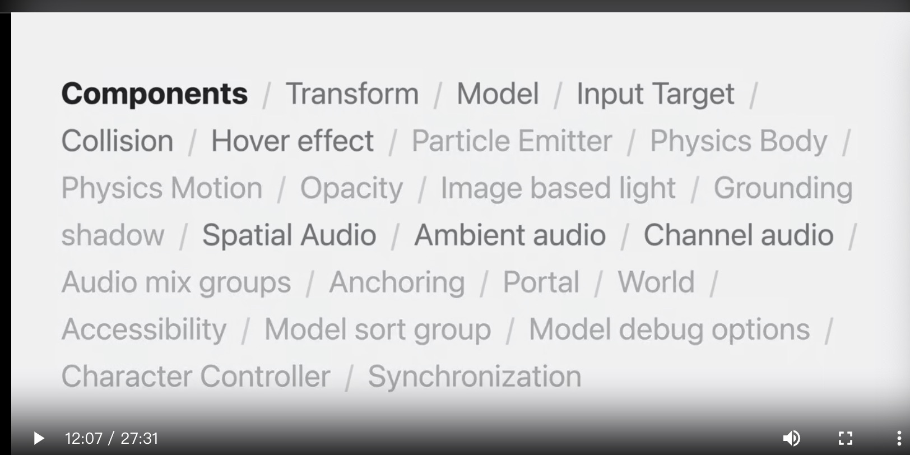

# 使用 RealityKit 构建空间体验

### RealityKit介绍
* 整合2D和3D混用
* 带入身临其境的体验中
* Apple核心3D框架，尤其vrOS

### RelityKit and SwiftUI
* Model3D很容易替换掉原有的Image
	* 异步加载后排版
	* 有占位生成器
* Model3D放置在最前面
	* window样式：.Volumetric
	* 保持真是的固定尺寸
	* 可以缩放下也保持真实
* Windows Group


### 实体，组件
* swiftUI中有两种使用RealityKit：
	* Model3D，RealityView
* Entity不能直接展示，需要通过加入Compnents
	* 材质组件
	* 变换组件 - transform component
		* 将实体放入3D空间中
		* 控制位置，方向，设置其属性以及设置父级来缩放
* 坐标空间
	* 单位是1米
	* RealityView有一个函数来回切换RealityKit和SwiftUI之间的坐标

* 每个实体都有一个变换，但并非每个实体都有模型。
* 有时，一个实体由多个子实体组装而成，每个子实体都有自己的一组组件。
`例如，您可以在子实体的变换上播放单独的动画。`



### RealityView
* 是一个SwiftUIView，包含RealityKit的Entity
	* 只有加入到该View后，才能够渲染，动画，模拟等一系列行为。
* 通过update闭包关联SwiftUI中的state及参数
* 坐标转换：坐标点，边界框（bounding boxes）
* 订阅实体和组件发布的事件
* SwiftUI视图附加到实体中
	详细请看：“使用 RealityKit 增强您的空间计算应用程序”

### Hover Effects
* 隐私保护 - 用户知道现在那个app处于高亮活跃态

### Input，动画，音频
* 手势
	* 手势是添加在实体上的
	* 1. RealityView接受触摸事件，2. 排除不具备输入目标和不具备碰撞的实体（Collision, InputTarget）
	* 相关知识Eric 的会议“认识 Reality Composer Pro”。

* 碰撞组件模型默认是立方体
	* 碰撞模型合理近似视觉模型非常重要
	
* 内置动画：
	* from-to-by，轨道动画等
* 音频空间(3种)：
	* 空间音频
	* 环境音频：固定位置发音，合适捕获环境声音的多通道文件，不会额外添加混响
	* 通道音频：背景音乐

### 自定义系统
* 可编码组件将出现在 Reality Composer Pro 界面中，并且可以在设计时直接添加到实体中。

### 系统
* 实体、组件和系统（或 ECS）是用于对 3D 体验的外观和行为进行建模的工具。
* 系统是构建实现应用程序行为的代码的一种方法

* 大概工作原理：
	1. 注册到场景中
	2. 在有变化时候会调用到update，传进来上下文。
	3. 根据上下文过滤出需要的entity，或者compnent

```
相关：“使用 RealityKit 增强您的空间计算应用程序”
“在 Xcode 中使用 Reality Composer Pro 内容”
```

https://developer.apple.com/videos/play/wwdc2023/10080/?time=807