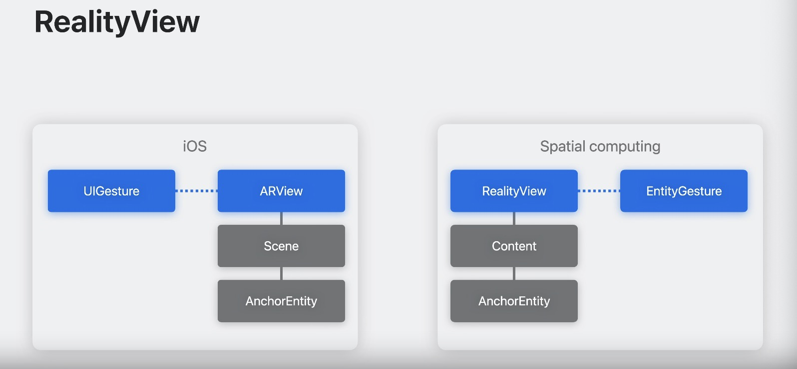
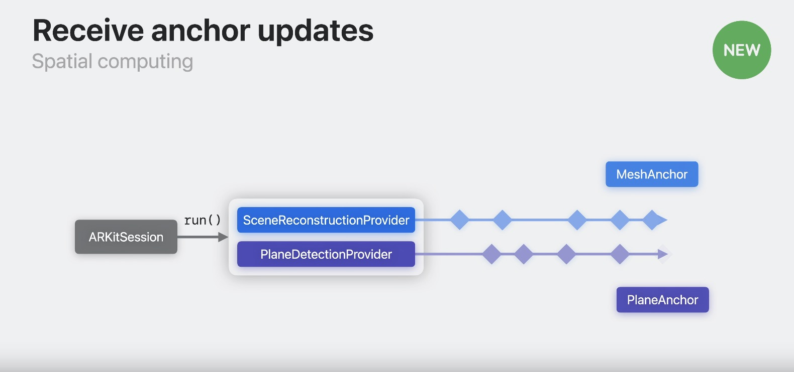

# 改进您的 ARKit 应用程序以获得空间体验

### spatial computing platform 空间计算框架

* ARKit和RealityKit深度集成
* 内置摄像头passthrough及用户双手抠图现已内置
*  ARKit 世界地图由系统服务持续保存，已内置


### 准备工作，新工具等
* 重复介绍一系列概念
* 锚定实体无需用户许可
* ARKit 数据是您的应用程序只能在完整空间中访问的其他数据。
* 当涉及 3D 内容时，最好依赖通用场景描述（简称 USD）等开放标准。

* USD资源准备

```
USD assets -> Reality Composer Pro -> xCode project
```

* iOS 上为 3D 内容使用 CustomMaterials，则需要使用其着色器图来重建它们。
* 直接通过 UI 编辑 RealityKit 组件。
* 资源一般有USD，材质，自定义组件

### RealityView
* 适配2D，3D的结合点
* 装配Entities
* 使用SwiftUI的手势互动
* 模拟虚实结合

#### Entity Component system（ECS）
* 抽象了这几个组合，自己定义了这个新名词

#### 对比ARView vs RealityView
* ARView启动锚点需要用户授权，RealityView则不需要


### 虚拟现实
* 重复讲解怎么使用锚点，Entity等

* Transforms彼此之间不互通
* 不同锚定实体的子实体彼此不知道


### 光线投射 Raycasting
* 使用Collision compnents
* 通过将 SpatialTapGesture 添加到 RealityView，人们可以通过查看实体并点击来进行光线投射。
* 使用手指关节信息来构建查询的射线原点和方向。有了光线的原点和方向，我们可以对场景中的实体进行光线投射。


### ARKit更新
