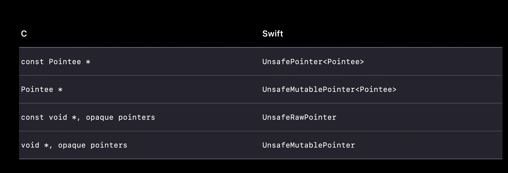
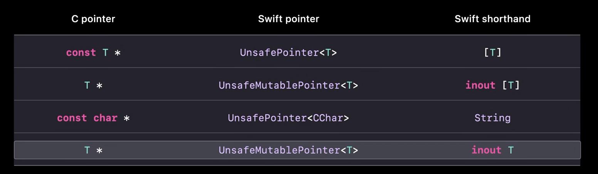

# 不安全的Swift

### # 定义
* 强制解包是安全的
* 不安全操作必须在至少某些违反其记录期望的输入上表现出未定义的行为。

#### 1. 后果
* 可能会立即触发崩溃
* 可能返回一些垃圾值
* 它可能每次都做同样的事情
* 可能每次执行的结果可能会改变。

#### 2. 好处
实现一些否则很难或不可能做到的事情：

* 它们要么提供与 C 或 Objective-C 的互操作性，
* 提供对运行时性能或程序执行的某些其他方面的细粒度控制。
	* 可选类型的不安全解析

**Safe code ≠ no crashes**

### # Unsafe Pointer

#### 1. 平面内存模型: Flat address space

#### 2. 不安全指针使用
* 需要自己处理好创建释放
* 释放完继续使用，可能会导致崩溃，也可能覆盖不相关功能的数据，使得用户数据丢失

#### 3. 为何要使用
* 与c等语言交互

* 系统提供四种不安全的buffer pointer
	* 仅提供了边界检查。
	
* Swift 支持的此类隐式值到指针转换的列表

#### 4. 指针的生命周期仅在使用范围内。

#### 5. 工具
* Address Sanitizer
