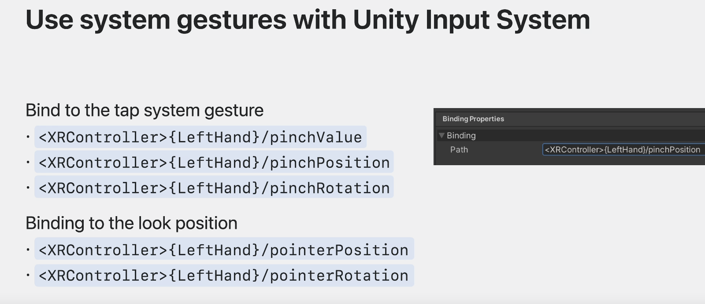

# 将您的 Unity VR 应用带入完全沉浸式的空间

### # Full space构建流程

* Unity 利用合成器服务，并为您的应用程序提供 Metal 渲染功能的强大功能。
* Unity 还利用 ARKit来识别您的身体位置和周围环境，包括骨骼手跟踪。
* Unity 基于这些技术构建，在 Unity 引擎中提供相同的服务。

#### 1. 可以利用两种环境

* 用您自己的环境替换玩家周围的环境。
* 将内容与直通混合创造与周围环境融为一体的沉浸式体验。 相关文档： "Create immersive Unity apps." 


### # Full space怎么做

* 我将介绍将内容从 Unity 部署到设备的工作流程。
* 您需要记住一些与此平台上的图形相关的事项。
* 我将讨论如何使控制器输入适应手动输入，以及 Unity 提供的一些工具来帮助完成这种转换。

#### 1. 编译and部署流程
* 选择该平台的构建目标。
* 就像在任何其他 VR 平台上一样，启用 XR 插件。
* 如果您的应用程序依赖于本机插件，则需要针对该平台重新编译它们。
* 生成xCode项目
* 运行xCode进行模拟器或者设备进行测试

#### 2. 准备图形渲染
##### a. 通用渲染管道

##### b. 静态“注视点渲染”(Foveated Rendering)
**是一种将更多像素密度集中在眼睛可能聚焦的每个镜头中心的技术，并将较少的细节集中在眼睛对细节不太敏感的屏幕外围。**

* 使用通透技术（throughout）时，静态注视点渲染将应用于整个管道。
* 当您使用通用渲染管道时，静态注视点渲染将应用于整个管道。
	* 适用于所有 URP 功能，包括后处理、相机堆叠、HDR 等。
* 自定义渲染通道想使用该功能，Unity 2022 中提供了新的 API可以利用。
* 由于渲染现在发生在非线性空间中，因此还有着色器宏来处理重新映射。

##### c. 单通道实例渲染：
* 引擎只需为双眼提交一次绘制调用，并减少某些部分的开销渲染管道的一部分，例如剔除和阴影。
* 减少了以立体方式渲染场景的 CPU 开销。
* 使用单通道实例渲染在其他 VR 平台上正确渲染，着色器宏可确保它也可以平滑迁移过来。
##### d. 深度缓冲区
* 应用程序正确写入每个像素的深度缓冲区。（All effects）
	* 只要深度信息丢失，系统就会渲染错误颜色作为指示。
* Unity shaders work out of the box
	* 已经修复了所有 Unity 着色器，以将正确的值写入深度缓冲区
* 自定义的shaders写入每个像素的深度

#### 3. 输入交互
* XR 交互工具包添加了手部追踪功能让您更轻松地适应现有项目。
	* XRI 抽象了输入类型（例如手部跟踪），并将该输入转换为您的应用程序可以响应的操作。
	* 可以跨接受不同类型输入的平台工作。
	* XRI 可以轻松响应3D 空间和 3D 空间世界 UI中的常见交互，例如悬停、抓取和选择。
	* 提供一个运动系统，使人们可以更舒适地穿越完全沉浸式的空间。
* 使用 Unity 输入系统对内置系统手势
* 访问原始手关节数据，与 Unity Hands Package 进行自定义交互

##### a. Interactable交互类型
XRI 的核心是一组基本的 Interactable和 Interactor 组件。

* 简单的交互
* Grab
	* 当选择或抓取对象时，它将跟随 Interactor并在释放时继承其速度。
* Teleport 交互项（例如 TeleportArea 和 TeleportAnchor）
	* 能够为玩家定义区域或点传送到。您还可以创建自己的自定义交互对象。
##### b. 交互器有多种类型
* 直接交互：触摸，靠近交互等
* 射线：远距离交互
	* 如果是抓取交互，您可能希望将对象移动到用户的手上。射线交互器可以限制抓取的自由度，以满足游戏需求。
* Socket Interactor：向玩家展示某个区域可以接受一个物体。
* 戳Poke交互：选择器等
	* 与直接交互器类似，不同之处在于它包括方向过滤，因此必须执行正确的运动才能触发交互。
* 观看（Gaze）进行交互，Gaze Interactor为 Ray Interactor 提供了一些扩展，使凝视更容易处理。
	* 例如，Gaze Interactors 可以自动使 Interactables 的碰撞器更大，以便更容易选择。
	
```
混合组合使用交互
您需要为每个 XR 交互状态（例如选择）绑定输入操作引用
可以双手使用XR交互
```

##### c. Unity 输入系统的系统手势输入
* 将平台的内置交互（例如点击手势）映射到您自己的交互系统。
* 使用 Unity 输入系统中的绑定路径访问并响应这些系统手势。


* **可以使用Unity Hands 子系统通过 Unity Hands 包访问系统中的所有原始手部关节数据。**(新的支持)
	* 原始手部关节数据的一个用途是将其映射到自定义手部网格视觉对象。
		* 比如双方say hello，比心展示给对方，提高沉浸感。
	* 可以编写代码来查看每个关节并确定该姿势与某个手势（例如竖起大拇指或食指）的接近程度，并将其转化为游戏动作
		* fuck，👍🏻，👌🏻等手势
		* 下面代码定义了一个方法来告诉您食指是否伸出
	
```
// Translate raw joints into gameplay actions

static bool IsIndexExtended(XRHand hand)
{
    if (!(hand.GetJoint(XRHandJointID.Wrist).TryGetPose(out var wristPose) &&
          hand.GetJoint(XRHandJointID.IndexTip).TryGetPose(out var tipPose) &&
          hand.GetJoint(XRHandJointID.IndexIntermediate).TryGetPose(out var intermediatePose)))
    {
        return false;
    }

    var wristToTip = tipPose.position - wristPose.position;
    var wristToIntermediate = intermediatePose.position - wristPose.position;
    return wristToTip.sqrMagnitude > wristToIntermediate.sqrMagnitude;
}
```

	

### # 总结
* [https://create.unity.com/spatial](https://developer.apple.com/videos/play/wwdc2023/10093/?time=95) 注册使用最新版本
* 可以使用 XR Interaction Toolkit和 Unity Hands 包。
* 请用 Unity 2022 或更高版本
* 考虑采用通用渲染管道。虽然支持内置图形管道，未来的所有改进都将在通用管道上进行。
* 开始将任何基于控制器的交互调整为手部交互。您今天就可以开始使用 XR Interaction Toolkit和 Unity Hands 包。
* 相关文档：
	* "Create immersive Unity apps." 
	* "Build great games for spatial computing" 

地址：[https://developer.apple.com/videos/play/wwdc2023/10093/?time=95](https://developer.apple.com/videos/play/wwdc2023/10093/?time=95)