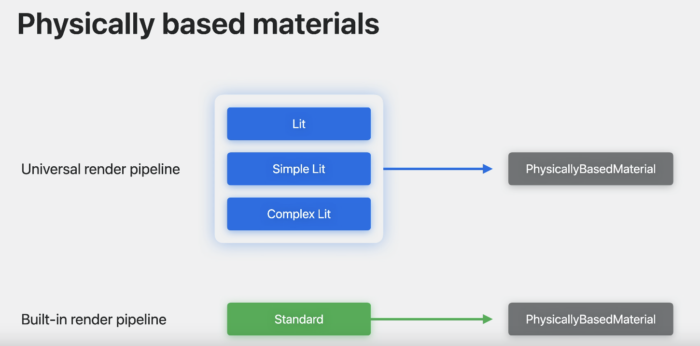
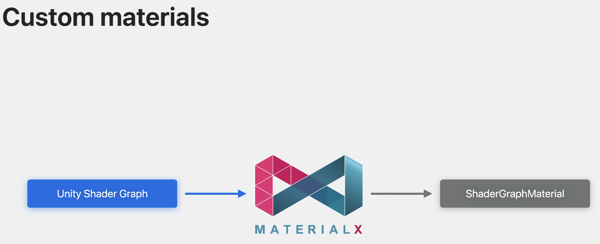
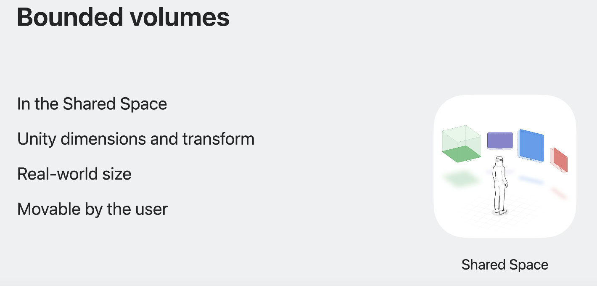
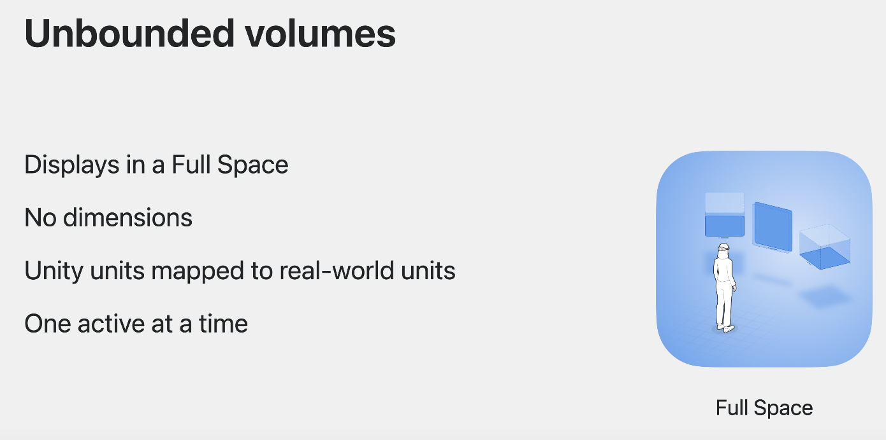
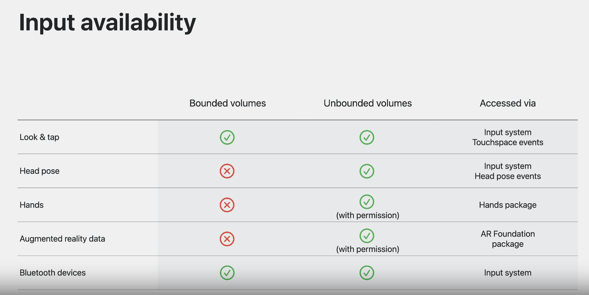
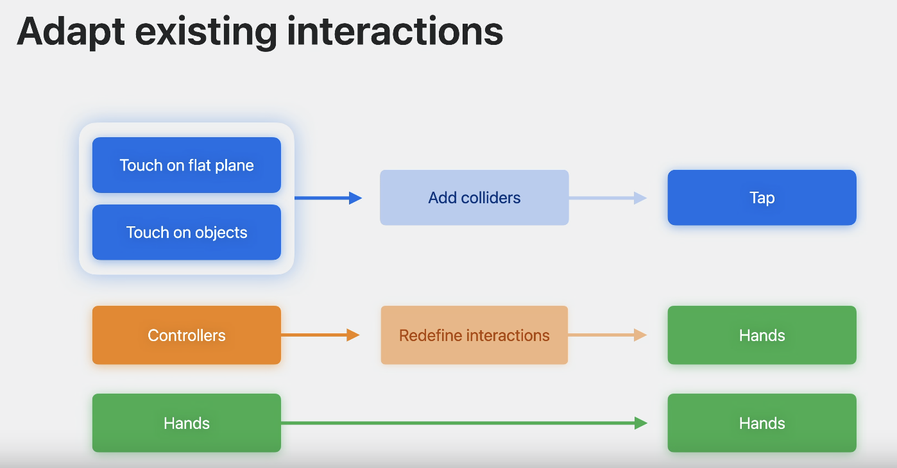

# 创建沉浸式 Unity 应用程序

### # 吹起来
#### 1. 两种创建沉浸式方式
* 使用直通（passthrough）方式创建将内容与现实世界对象混合的体验，既可以作为沉浸式体验，也可以与其他应用程序一起在共享空间中。
* 完全身临其境的 Unity 体验。

#### 2. 可以干啥
* 使用 Unity 的着色器和材质实现您想要的视觉外观。
* 直接进入设备播放模式的功能，从而缩短了迭代时间。
* 体积相机（volume cameras）的新概念，它控制如何将 Unity 场景中的内容带入现实世界。
* 更复杂的交互，也可以像点击手势一样简单

### # 达到视觉外观
* 共享空间中的所有内容均使用 RealityKit 渲染。Unity 材质和着色器需要转换到这个新环境。
	
#### 1. Unity的PolySpatial
它会为您处理此转换，并将许多 Unity 功能带入此环境。

* 可转换材质、
* 常规和蒙皮网格渲染
* 粒子效果
* 精灵
* 模拟功能
	* 可以继续使用 MonoBehaviours、可编写脚本的对象和其他标准工具。
* 基于 Unity 物理着色器的材质可直接转换为 RealityKit。

#### 2. 三类材料
* 物理的材质
	* 基于 Unity 物理着色器的材质可直接转换为 RealityKit。
	* 使用通用渲染管道，则可以在材质中使用任何光照、简单光照或复杂光照着色器。
	* 通过内置管道，可以使用标准着色器。
	* 以上都被转换为 RealityKit PhysicallyBasedMaterial。
	
* Unity Shader Graph支持自定义着色器和材质类型。转换为 MaterialX，这是复杂材质的标准交换格式。
	
	* 通过 RealityKit 渲染不支持手写着色器
	* 可以与 Unity 中的 RenderTextures 一起使用
	* 使用 RenderTexture作为 Shader Graph 的纹理输入，以便通过 RealityKit 显示。

* 两种附加材质着色器类型
	* 无光照着色器，它可以让您创建具有纯色或纹理的对象，而不受光照的影响。
	* 遮挡着色器，它允许穿透显示对象。
		* 可以将遮挡着色器与世界网格数据结合使用，帮助您的内容感觉与现实世界更加融合。
		
### # 网格and models
* 渲染
	* MeshRenderer网格渲染
	* SkinnedMeshRenderer
	* 以上两种将视觉内容转换为真实空间的主要方式。
* pipeline：将内容通过 Unity PolySpatial转换为 RealityKit 。
	* 通用的渲染管道
	* 内置的渲染管道

* RealityKit 执行最终渲染

### # 粒子和精灵
* Unity 的 Shuriken 系统的粒子效果可以转换为：
	* 简单的：RealityKit 的粒子系统（如果兼容）
	* 复杂的：转换成mashes

* 精灵
	* 转换为mashes，考虑如何在空间上下文中使用它们。

### # Unity模拟功能
* 可以模拟物理、动画和时间轴、寻路和导航网格、自定义 MonoBehaviours以及其他非渲染功能。
* Unity PolySpatial 启用了“播放到设备”
	* 完成构建过程才能查看内容在设备上的外观可能需要一些时间。
	* 通过播放设备，您可以即时预览场景并对其进行实时更改。
	* 使用“在设备上播放”来快速浏览内容的位置和大小，包括添加和删除元素。
	* 更改材质、纹理甚至着色器图来微调您的外观，同时通过直通查看内容。
	* 测试交互，因为事件会发送回编辑器。
* ***Play to device目前在 Unity 中仅可用于在共享空间中创建内容。***
	
### # 浏览空间体积相机
* 体积相机可以创建两种类型的体积，应用程序可以随时在两者之间切换。
	* 有界体积

	* 无界体积

### # 交互输入
* Unity 支持该平台上的应用程序的多种输入类型
	* 用眼睛和手来查看内容
	* 手指点击来选择内容
	* 全手部跟踪以及头部姿势数据可让您创建逼真的交互
	* 来自 ARKit 的增强现实数据以及键盘
	* 游戏控制器等蓝牙设备都是可用的
	
#### 1. Look & Tap
* 输入必须配置输入碰撞器
* 可以从远处查看并点击以选择对象
* 可以伸出手指直接触摸对象
* 最多可以同时进行两个点击操作
* Unity中点击可用作 WorldTouch 事件

#### 2. Hands和头部动作
* 低级手部数据通过 Unity 的 Hands 包提供
* 头部姿势通过输入系统提供

* 以上两种只在无限系统（unbounded volumes）中使用
* 需要弹窗，用户同意使用权限

#### 3. 增强现实数据
* 检测到的平面
* 世界网格
* 图像标记

* 以上通过 ARKit 和 Unity 的 AR Foundation 获得。
* 以上数据只在无限系统（unbounded volumes）中使用
* 需要弹窗，用户同意使用权限

#### 4. 蓝牙设备
* 键盘、控制器和其他受支持的设备

### # 现有交互迁移
* 触摸系统，仅需要考虑加入碰撞器
* 使用 VR 控制器，必须根据点击或手动输入重新定义交互，具体取决于它们的复杂程度
* 现有的手动输入无需更改

### # 现有UI迁移
* 支持使用 uGUI以及 UI Toolkit 构建的用户界面元素
* 其他 UI 系统，只要使用网格和 MeshRenderer 或绘制到 RenderTexture，然后将其放置在网格上。

### # 新平台准备
* 使用 Unity 2022 或更高版本。
* 手写着色器，转换为 Shader Graph
* 考虑采用通用渲染管道
	* 虽然支持内置图形管道，但未来的所有改进都将针对通用管道
* 使用输入系统包
	* 支持混合模式输入，但平台事件仅通过输入系统传递。

* 考虑您的想法是否适合共享空间以便为人们提供更大的灵活性，或者应用程序是否需要完整空间的功能。

unity：[http://unity.com/spatial](http://unity.com/spatial)

地址：[https://developer.apple.com/videos/play/wwdc2023/10088/](https://developer.apple.com/videos/play/wwdc2023/10088/)