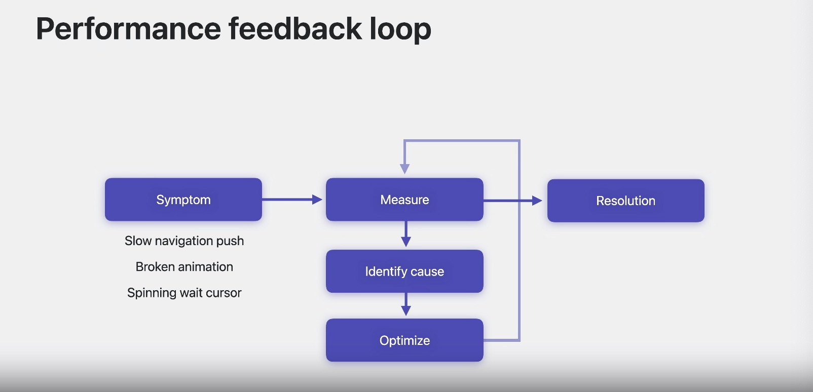

# 揭秘 SwiftUI 性能

### # 性能问题反馈循环



#### 1. 症状Symptom
* 导航推送缓慢
* 动画损坏
* macOS 上看到旋转的等待光标

**性能问题，最好拥有尽可能多的工具来分类和修复它们。**


### # 依赖
* Explore依赖
	* 使用Self._printChanges调试
		* 仅供调试

```
举例，View中的dog.image与image在依赖关系中的区别
```


### # Faster视图更新
* 更少的更新意味着更好的性能，去除不必要的依赖
* 减少挂起引起的延时掉帧
* 小故障：
	* 滚动动画

* 建议看“在 SwiftUI 中发现观察” wwdc23
* WWDC23 的“Analyze Hangs in Instruments”
* 请观看“探索 UI 动画故障和渲染循环”技术讲座

##### 原因
* 动态属性实例化，比如：初始化state的实例
* 在body方法中处理太多工作
	* 数据过滤
	* 字符串插入，操作等
* body中缓慢的识别

##### 影响
* 请求使用task和await异步化
* 字符串插值
* 从Bundle查找资源
* 堆分配（类型绑定）

### # 列表，table中的id
* iOS17做了优化：过滤，滚动，展示大表

* 有一些构建列表和表格的方法可以带来更好的性能
* 为了保持一致性，List 和 Table 的所有 ID 都被急切地收集起来
* 行数由内容决定，快速搜集生成标识符

学习：“SwiftUI 动画基础知识” wwdc23

#### 1. List
* 行是按需创建的，列表使用标识和内容的组合来生成列表行。
	* 按需创建的行与可见区域相关，加上一些系统确定的用于预取或可访问的缓冲区

**建议**

* 在列表中避免使用AnyView
* 在适当的情况下使用显式堆栈，但请注意某些修饰符（例如 listRowBackground）需要位于堆栈之后而不是位于堆栈内。
* 尝试摧毁ForEach
* 可以使用动态的section，是个好例子

**行数 = 元素数 * 每个元素视图**

* 需要确保每个元素的视图数量是一个常量


