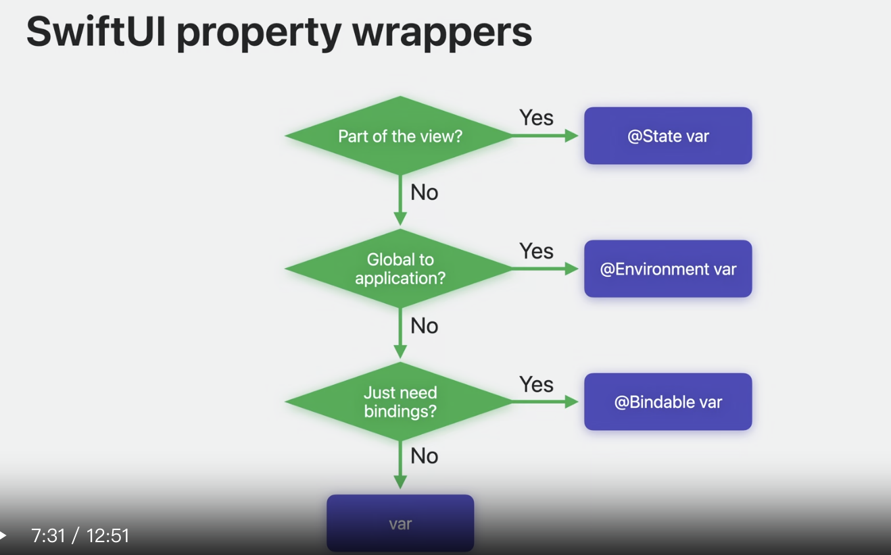
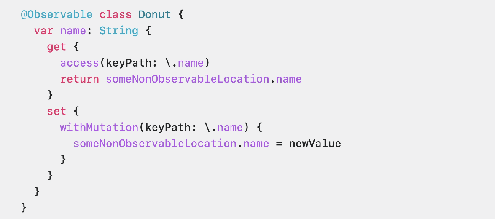

# 在 SwiftUI 中的发现观察
### # 什么是Observation
* 跟踪属性修改的功能
* 使用swift普通类型，通过宏加持转换
* 5.9新功能让model变得更简单

### # SwiftUI属性wappers
* 几个关键字
	* @Bindable
	* @Observable
	* $
	

### # 高级使用

* 计算属性
	* SwiftUI可以tracking访问
	* 计算属性透过访问其他的存储属性
	* 直接使用观察来手动添加这些调用以标记访问和突变

### # ObservableObject -> @Observable宏
* 删除Published，协议替换为宏
* 删除使用方的@ObservedObject
* “@EnvironmentObject”包装器被转换为“@Environment”
* 将它们简化为三个主要属性包装器；@State、@Environment 和 @Bindable。

**“Write Swift macros” wwdc23**
**“Expand on swift macros” wwdc23**