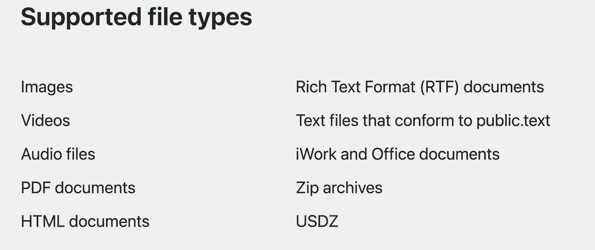

# Discover Quick Look for spatial computing

### # Quick Look 
* mac上选中后使用空格按键可以预览图片等

### # xrOS

* USDZ 文件会在我放下它的位置显示 3D 快速查看预览
* 可以使用手势

* 窗口化快速查看允许您在应用程序外部呈现快速查看预览。
* “快速查看”窗口中显示的某些文件类型提供 SharePlay 体验，因此您可以共享文件并通过FaceTime 查看该文件
	* 分享时，能够与其他人一起标记该图像。

* 应用程序和网站都可以在“快速查看”窗口中呈现内容，并利用它提供的许多好处。
	
	
* web中的快速查看
	* 当您在 xrOS 上打开标记的 3D 内容的链接时，Safari 将呈现 3D 内容在新的“快速查看”窗口中
	* **网站可以做出1:1渲染的3d体验**
	* 模特试装app

* app内的快速查看
	* 使用quicklookPreview
	* 更多自定义选项，您可以在此处使用 QLPreviewController
	

### # 支持的类型

#### 有提到可以轻松编辑，但是好像没有讲
https://developer.apple.com/videos/play/wwdc2023/10085/?time=32