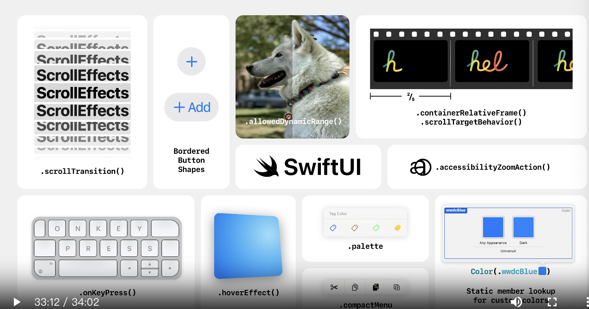

# What’s new in SwiftUI

### # 新平台

* 一个东西重复洗脑讲解visionOS平台
	* 参考：“Meet SwiftUI for spatial computing” wwdc23
* watchOS10
	* NavigationSplitView 和 NavigationStack获得了漂亮的新过渡。
	* TabView 获得了由数字表冠驱动的新垂直分页样式。
	* 新的containerBackground修改器允许您配置这些微妙的背景清洗

* 预览版利用 Swift 5.9 中的宏来提供优雅的新语法。
* xCode新面板及功能
* macOS Sonoma 上的桌面小部件可以让人们在日常生活中了解最新信息

* MapKit 提供了一次大规模更新
	* 观看：“认识 SwiftUI 的 MapKit”

* “Swift中的新增功能”来概述 Swift 中的所有新功能。

### # 简单的data flow
* 基于宏定义的数据观察
* SwiftData 是一个全新的数据建模和管理框架。
	* 服务于SwiftUI
	* 使用 Query 将告诉 SwiftData从底层数据库获取模型值。
	* SwiftData 也非常适合在 macOS 和 iOS 上存储文档数据
	* 请观看“认识 SwiftData”和“使用 SwiftData 构建应用程序” wwdc2023
* DocumentGroup在 iOS 17 或 iPadOS 17 上运行时还获得了许多新的平台功能，例如自动共享和文档重命名支持，以及工具栏中的撤消控件。
* OutlineGroup，新的 DisclosureTableRow
	
### # 牛皮的动画

### # 增强的交互

