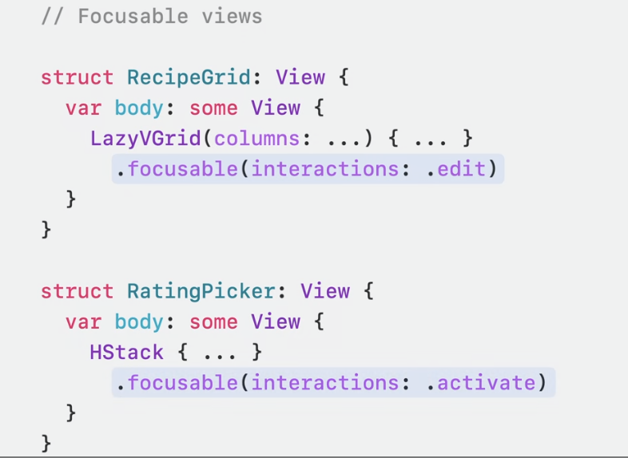

# 聚焦 SwiftUI 的cookbook

### # 什么是focus
每个平台有差异，电脑的鼠标悬停，手表中的边框等

* 预测输入的位置
* 跟踪UI那部分是输入的目标

### # 构成要素
* 可聚焦视图
* 焦点状态
* 焦点值
* 焦点部分

### # 核心探索
* 控制焦点外观
* 观察焦点移动
* 使用自定义控件响应键盘输入的方法

* 地址：[https://developer.apple.com/videos/play/wwdc2023/10162/](https://developer.apple.com/videos/play/wwdc2023/10162/)