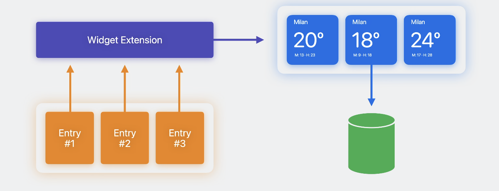

# Bring widgets to life

### # 动画

* 不适用state状态 `withAnimation {}`来驱动动画
* 对应于特定时间呈现的不同视图
* 默认小部件会获得隐式弹簧动画和各种隐式内容转换
* SwiftUI 在box外提供的所有转换、动画和其他自定义内容转换动画API

```swift
struct LastDrinkView: View {
    let log: CaffeineLog

    var body: some View {
        VStack(alignment: .leading) {
            Text(log.drink.name)
                .bold()
            Text("\(log.date, format: Self.dateFormatStyle) · \(caffeineAmount)")
        }
        .font(.caption)
        .id(log)
        .transition(.push(from: .bottom))
    }

    var caffeineAmount: String {
        log.drink.caffeine.formatted()
    }

    static var dateFormatStyle = Date.FormatStyle(
        date: .omitted, time: .shortened)
}
```

* 相关“使用 Xcode 预览构建编程式 UI” wwdc2023，在预览中查看动效

```
#Preview(as: WidgetFamily.systemSmall) {
    CaffeineTrackerWidget()
} timeline: {
    CaffeineLogEntry.log1
    CaffeineLogEntry.log2
    CaffeineLogEntry.log3
    CaffeineLogEntry.log4
}
```
### # 交互
* widget如何工作
	* 小部件扩展由系统发现并作为独立进程启动运行
	* 小部件定义了一个返回一系列条目的时间线提供程序，数据提供方
	* 系统将启动小部件扩展进程并向其时间线提供者请求数据
	* 视图构建器获得数据，并用于根据这些数据生成一系列视图
	* 系统生成这些视图的表示并将其存档在磁盘上
	* 当需要显示特定条目时，系统会在其进程中解码并呈现小部件的存档表示形式。
	* 以上时间线视图代码仅在归档期间运行，由系统进程呈现

	* 可以在获取时间线时动态获取数据

* 核心路径
	* 在独立线程中渲染工作
	* 有timeline驱动数据来更新
	* 保证在有交互时候进行更新

* App Intent通信
	* AppIntent 是一个协议，允许您在代码中定义可由系统执行的操作。
	* 相关WWDC22 和 23 的“深入了解 App Intents”和“探索 App Intents 的增强功能”会议

* App Intent控制
	* 交互式小部件仅支持使用 AppIntent 的 Button 和 Toggle 。其他控件将不起作用。
	* 初始化程序也可以在应用程序中使用，可以在小部件和应用程序之间共享应用程序意图逻辑。
	* 使用 invalidatableContent 修饰符来注释此视图。可以快速调试更新视图

	

### # 地址
[https://developer.apple.com/videos/play/wwdc2023/10028/](https://developer.apple.com/videos/play/wwdc2023/10028/)
	
	
	
	