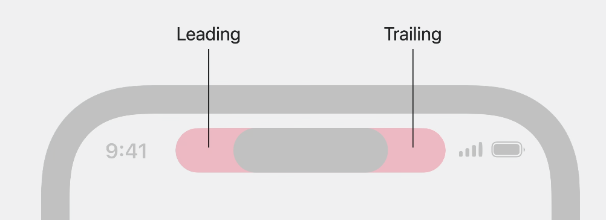
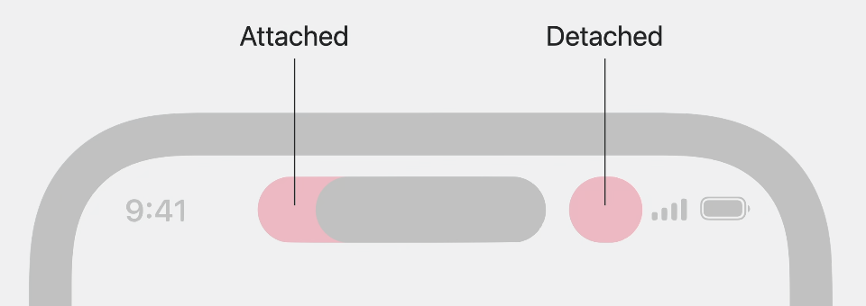
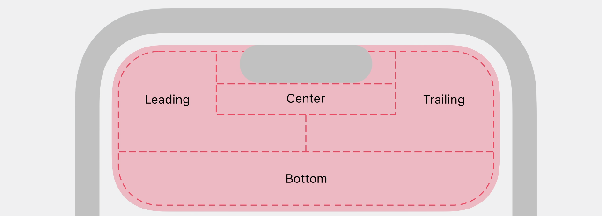

# Meet ActivityKit

### # 概览

* 实时活动是一种沉浸式、一目了然的方式来跟踪事件或任务的进度。
* 实时活动具有离散的开始和结束
* 可以从后台应用程序运行时或使用推送通知远程提供实时更新

* 灵动岛一次最多可显示两项活动

* iOS17 交互式实时活动（ WidgetKit 和 SwiftUI ）
	* 充分利用强化后的widget
	* 只能添加按钮或开关来增强用户体验

#### 1. 编程相关
* 使用ActivityKit framework
* 布局swiftUI，WidgetKit
* 当您的应用程序位于前台时，可以请求实时活动
	* 仅在离散的用户操作之后请求实时活动，可能是“跟随”事件，或显式开始任务
* 必须支持锁屏和灵动岛
	* API 要求您支持从锁定屏幕到所有三个动态岛演示文稿的所有演示文稿。
	* 在StandBy下，系统会缩放锁定屏幕演示文稿以填满屏幕
* 可以通过使用“liveactivity”推送类型的推送通知来远程更新实时活动。
	* “Update Live Activities with push notifications.” wwdc2023

### # 生命周期
* 请求
	* Activity的pushType: nil：此活动只能在本地接收更新
```
import ActivityKit

struct AdventureAttributes: ActivityAttributes {
    let hero: EmojiRanger

    struct ContentState: Codable & Hashable {
        let currentHealthLevel: Double
        let eventDescription: String
    }
}
```
	
	
* 更新
	
* Observe activity state
	* 活动状态更改可能在实时活动的生命周期中随时发生* 
	* 4种状态：“开始”，“完成”，dismissed，stale过时
	* 
* End

### # ActivityKit UI

#### 1. 锁定屏幕
* 入口
* 配置
	* WidgetConfiguration：传递“AdventureAttributes”类型，与容器匹配

#### 2. 灵动岛：紧凑型、最小型和扩展型
* 紧凑的演示文稿有两个区域：前导区域和尾随区域

* 最小视图应该只包含最关键的信息

* 扩展型


### # 设计Live Activity UI
* 保持简单，并在用户点击实时活动时显示应用程序的其他详细信息
* 使用实时活动作为强大的工具来显示正在进行的活动的一目了然的实时信息。
* 通过简单的配置，创建一种与 iOS 和 iPadOS 上的用户互动的动态方式。


[https://developer.apple.com/videos/play/wwdc2023/10184](https://developer.apple.com/videos/play/wwdc2023/10184)


