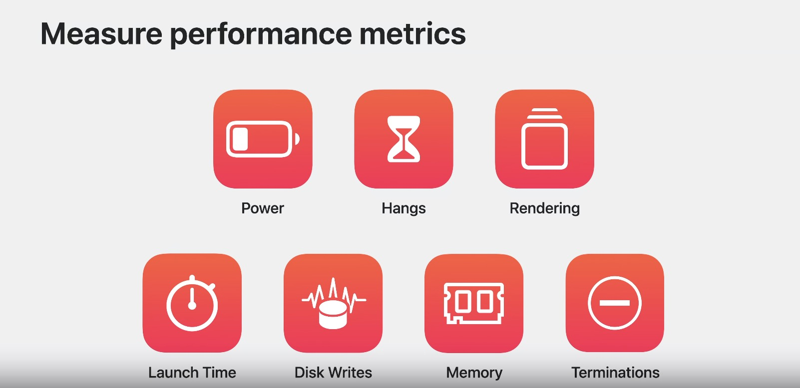
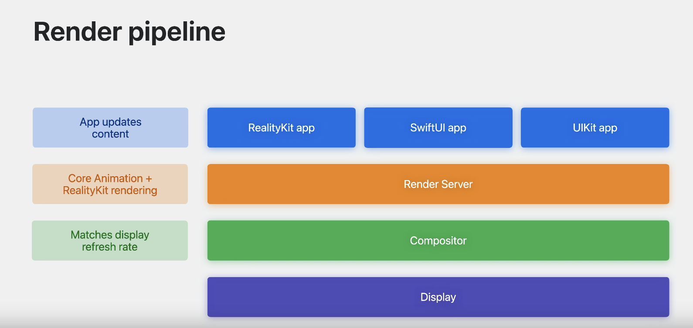
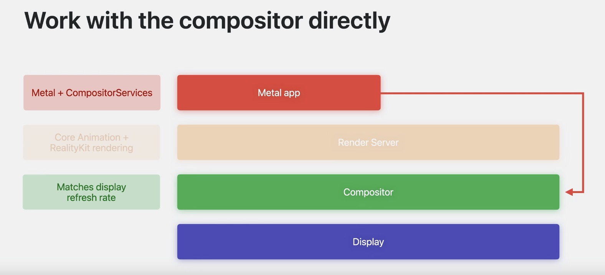

# 优化空间计算的应用程序功能和性能

### 空间计算 -  新功能性能独特之处
#### 1. 特点
* 持续更新内容 - 手势，身体，头
* 持续的渲染每一个frame
* 始终运行空间算法来在每个应用程序中创建视觉效果和交互
* 可以同时运行多个应用程序

#### 2. 用户期望
* Responsiveness - 响应
* Immersion - 沉浸感
* Comfort - 舒适

### 构建性能分析Profile
#### 1. 衡量办法及标准


* 比之前多了Hangs
* 概念及要求与之前平台是有差异的

##### a. Take Power
* 优化功耗，不是关注电池寿命，而是热压力的控制

##### b. Hangs 
* 主线程停滞一段时间后就会发生
* 即使是很小的、短暂的停顿也会影响响应能力。

##### c. 渲染
* 其他平台主要是UI和3D动画
* 除了这些，还有一直在渲染的静态内容

相关学习：“终极应用程序性能生存指南” "Ultimate Application Performance Survival Guide" wwdc2021

#### 2. 工具
* Instruments 和 Xcode Gauges 等工具
* 开发完成后测试或者公开发售：
	* MetricKit
	* 发布后：xCode组织平台搜集

#### 3. 开发时性能构建的几个场景
* 在设备上统计，模拟器和设备执行不相同
* 使用不同用户的各种交互分析
* 在播放音频或视频
* 使用 FaceTime 和 Personas 等技术时
* 检查持续后的性能（使用一定时间）
* 运行多个app时测试
* 多平台app确保iphone等其他平台正常

#### 4. 开发完成后
* 用户设备的汇总性能数据，包括能源诊断，以帮助发现任何电源问题。

### 优化

#### 1. 渲染
* 渲染过程
	* 渲染服务器和合成器持续运行
	* 渲染服务器处理来自应用程序、用户输入的更新，以及来自他们的空间和周围环境
	* 每秒90帧，可能更高
	* 讲述丢帧原理，涉及到deadline


##### a. SwiftUI，UIKit
* 绘制UI内容
	* 半透明静态UI内容会导致overdraw，产生绘制增加
	* 设置为不透明，只需要绘制当前UI
	 	
	* 如果有Z轴重叠UI，请避免半透明
	* UI像素越多，渲染窗口所需工作越繁重
	 
	* 用户的眼睛等动作产生动态内容缩放引起核心动画的绘制
	* 缩放矢量图文本分辨率等产生频繁绘制（即使app没有更新）
		* SwiftUI 和 UIKit 默认启用此行为，但执行自定义 Core Animation或 Core Graphics 渲染的应用程序可以选择此行为
	 
	 参考："Explore rendering for spatial computing." wwcd2023
 
* 重绘
	* 离屏渲染 - 根本是因为虚拟效果产生的
	* 减少不必要UI绘制更新
	* 使用@Observable with SwiftUI views
		* @Observable 提供更精细的更改跟踪并减少不必要的布局更新

##### b. RealityKit
* Reality Composer Pro 从网格渲染、粒子、动画、物理和音频等方面提供了统计数据可以优化

* 优化Mash Rendering

	```
	* 网格渲染尤其是 3D 渲染的核心部分
	* 复杂的网格和材质很快就会成为性能瓶颈。优化网格资源的几何形状。通过组合共享材质的零件来减少单独网格零件的数量。具有高三角形和顶点数的网格几何体的成本也可能很高。
	```
	
	* 减少网格部分，三角形，定点数量
	* 减少半透明引起的Overdraw
	* 建议使用Reality Composer Pro 中的“基于物理”材质具有环境照明，适用小透明度网格
	* 半透明或者更大请使用不发光表面的自定义材质或者背部发光纹理或其他材质

* common产生的昂贵更新
	* 频繁创建销毁实体
		* 提前创建，根据需要展示隐藏
		* 展平实体的层次结构
	* 复杂的动画
		* 基于代码得动画，考虑降低频率或者减少动画相关的实体数量
	* 太多的SwiftUI视图重绘
		* 当更新 RealityKit 实体时，避免意外触发过度的 SwiftUI 重绘。
		* 使用附件时，请确保以与优化所有 SwiftUI 内容相同的方式优化其渲染。
	* 加载太多的资源
		* 异步加载api
		* 提前加载
		* 相同资源共享，加载一次
		* 使用从 Reality Composer Pro 导出的文件，因为这些文件针对加载时间和内存成本进行了优化
		* 减少asset的尺寸
		
``` Reality Composer Pro已经进行了纹理压缩```

##### c. 优化完全沉浸内容
* GPU需要渲染的像素多得多（尽量减少）
* GPU功耗优化
* 使用不发光自定义材质，考虑添加背光纹理或者基于时间动画获得动态光照
	

##### d. Metal

* 将 Metal 与 CompositorServices 框架结合使用来绕过渲染服务器并将渲染的表面直接发送到合成器。参考: "Discover Metal for immersive apps" 

* 直接使用合成器服务
	* 提高提交速度提升合成器速率
	* 确保每个帧的查询数据
	* 确保查询数据在每次GPU编码前
	* 系统将终止提交超过deadilne渲染

* 优化GPU使用
	* 使用 Metal System Trace Instruments 模板分析 GPU 性能
	* 自定义材质的长时间运行的片段和顶点着色器执行可能会严重影响系统渲染时间
	* 要减少片段和顶点时间，首先要减少着色器的 ALU 指令和纹理访问
	* 尽量使用Metal compute shaders -- 相关内容wwdc18，19，20
	* 

#### 2. 用户输入
##### a. 输入相应时间
* 主线程处理输入更新
* 最少90fps，8ms内响应

##### b. 优化
* Reality3D中，添加物理碰撞进行交互
	* 使用静态碰撞器 > 动态碰撞器
	* 减少重叠交互内容

#### 3. ARKit
* 应用程序会影响系统功耗和视觉流畅度，基于它如何使用 ARKit 数据和锚定虚拟内容。

* 锚点
	* 每个锚点都需要进行计算
	* 是否需要连续跟踪锚点
	*  一次跟踪模式优于持续跟踪
	*  减少应用程序中持久性和暂时性锚点的总量。
		* 每个程序都可以添加持续性锚点，尽量不要添加太多
* ARKit数据
	* 查询最近的一次ARKit数据
	* 后期预测查询非常耗资源 - 通常仅Metal渲染引擎需要该数据
	* 对于仅放置到场景中，RealityKit替换ARKit不错
	* 为场景理解网格生成碰撞数据也很昂贵，不需要时候关闭
#### 4. 音视频播放
##### a. 空间音频
* 默认使用空间音频
* 需要实时计算工作内容

```过多音频可能会有系统控制问题或者音频延时```

##### b. 需要注意
* 同时播放音频源
* 移动音频源的数量以
* 声场的大小

##### c. 视频
* 减少播放期间UI及3D内容更新
* 不同帧率会有影响 - 考虑用 24 或 30 赫兹视频最佳功耗
* 较少并发播放的数量
* 相关："Create a great spatial playback experience" 

#### 5. SharePlay
* 首先拥有出色的本地性能
* 检查在SharePlay期间两端的性能
* 监测对电量的消耗，不会过热
* 使用SHarePlay期间，关闭不需要的功能

#### 6. System pressure App停止
##### a. 发热 vs 性能
* 当处于热压力下时，请减少应用程序中的工作
* 通过订阅ProcessInfo.thermalStateDidChangeNotofication 来执行此操作。
* 使用xCode中的热感应器处理 - 相关："Designing for Adverse Network and Temperature Conditions." wwdc19

##### b. 内存
* 如果您的应用程序有 UI 内容，请通过最小化屏幕外渲染通道、窗口总量和媒体内容来减少渲染内存分配。
* 对于 RealityKit 的 3D 内存，网格和粒子的纹理和几何尺寸调整器的分辨率可以显着影响内存使用。
* 播放音频和视频时，评估应用中所有音频和视频文件的总内存负载。
* 更改分辨率、比特率、文件格式和持续时间时，请考虑用户体验和性能与内存节省之间的权衡。

### 地址：
https://developer.apple.com/videos/play/wwdc2023/10100/?time=214